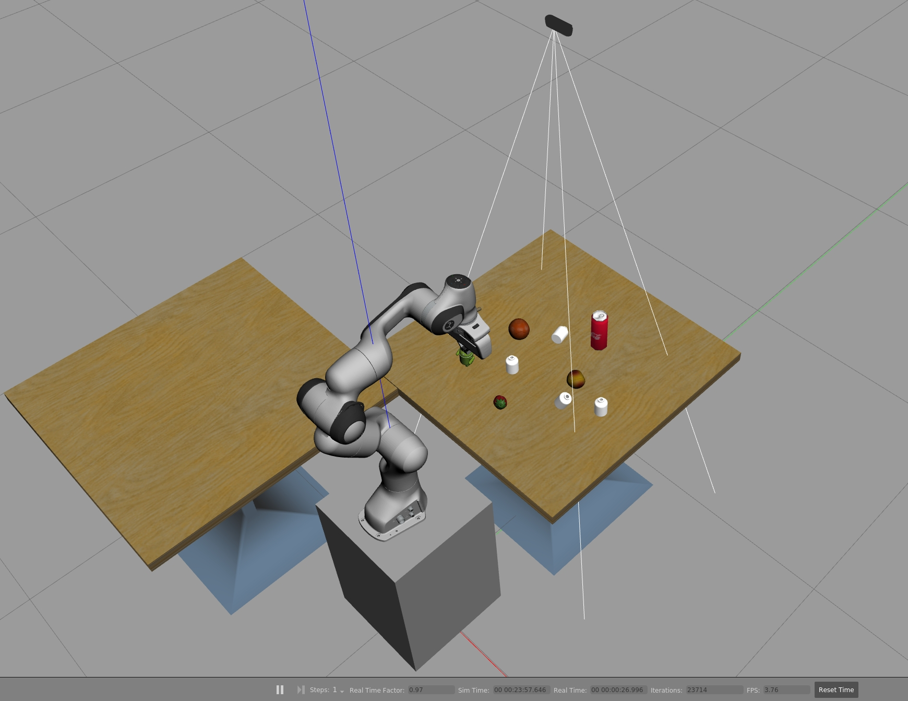
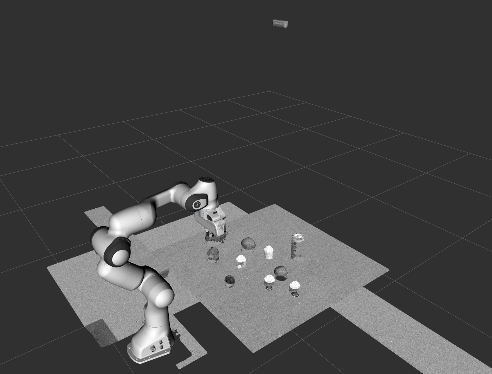
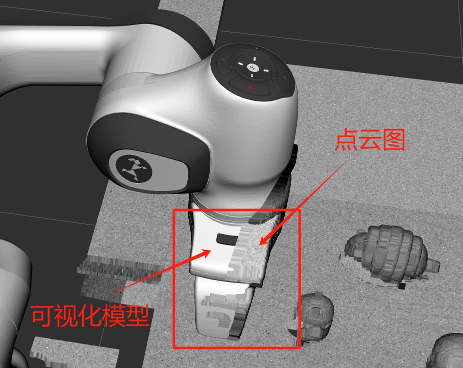
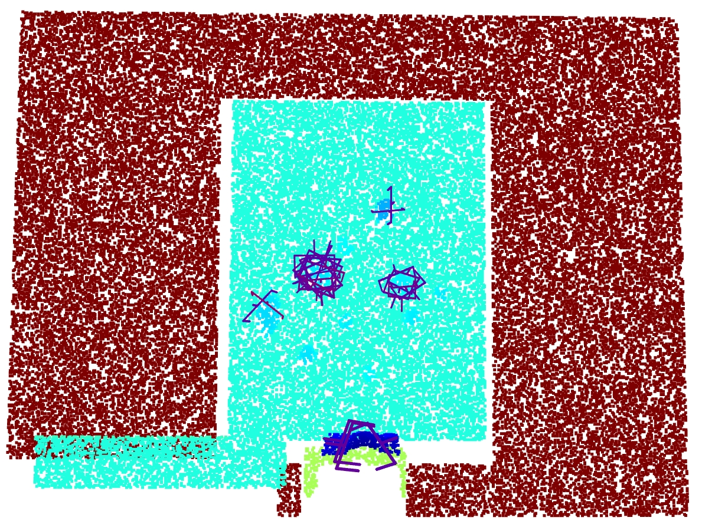
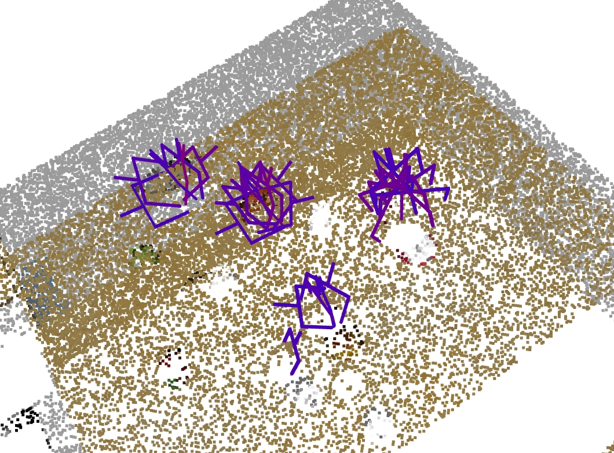

# grasp_sim

一个在`gazebo`环境中使用机械臂抓取物体的项目

可以用来验证抓取算法，可配合[抓取任务](https://github.com/hellototoro/arm_grasp)使用

本项目使用`panda`机械臂在`gazebo`环境中搭建了一个简单的抓取场景，并配合`realsense`做场景感知，还可使用[graspness](https://github.com/graspnet/graspness_unofficial)做抓取位姿的`6DoF`预测。

## 示例图片

以下是抓取场景的示例图片：

### 抓取场景

### RViz可视化

### 坐标对齐

### 使用graspness做6DoF预测

### Open3D可视化点云图

### 6DoF位姿
